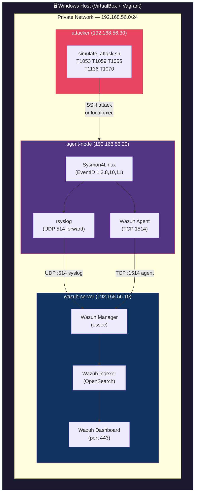

# Detection Home Lab — Architecture

## System Architecture



## Component Details

| Component | VM | IP | Role |
|---|---|---|---|
| Wazuh Manager | wazuh-server | 192.168.56.10 | SIEM core — receives, parses, and correlates events |
| Wazuh Indexer | wazuh-server | 192.168.56.10 | OpenSearch-based event storage and search |
| Wazuh Dashboard | wazuh-server | 192.168.56.10 | Kibana-like UI for alert visualization |
| Sysmon4Linux | agent-node | 192.168.56.20 | Kernel-level event capture (processes, network, files) |
| Wazuh Agent | agent-node | 192.168.56.20 | Forwards Sysmon + system logs to Manager |
| Attack Simulator | attacker | 192.168.56.30 | Executes MITRE ATT&CK technique simulations |

## Data Flow

```
Attack Script → Linux Kernel Syscall
                     ↓
               Sysmon4Linux (EventID capture)
                     ↓
               /var/log/syslog (JSON/XML event)
                     ↓
         ┌──────────────────────┐
         │   rsyslog (UDP 514)  │  ← EventID 3, 8, 10 (network-based)
         └──────────┬───────────┘
                    ↓
         ┌──────────────────────┐
         │    Wazuh Agent       │  ← All other events via localfile
         └──────────┬───────────┘
                    ↓
         ┌──────────────────────┐
         │   Wazuh Manager      │
         │  (Decoder → Rules)   │
         └──────────┬───────────┘
                    ↓
         ┌──────────────────────┐
         │   Wazuh Indexer      │
         │  (OpenSearch store)  │
         └──────────┬───────────┘
                    ↓
         ┌──────────────────────┐
         │  Wazuh Dashboard     │
         │  (Alert + MITRE tag) │
         └──────────────────────┘
```

## Networking

| Network | CIDR | Purpose |
|---|---|---|
| NAT (eth0) | 10.0.2.0/24 | Vagrant default — internet access for provisioning |
| Host-Only (eth1) | 192.168.56.0/24 | Lab internal — VM-to-VM + host-to-VM communication |
